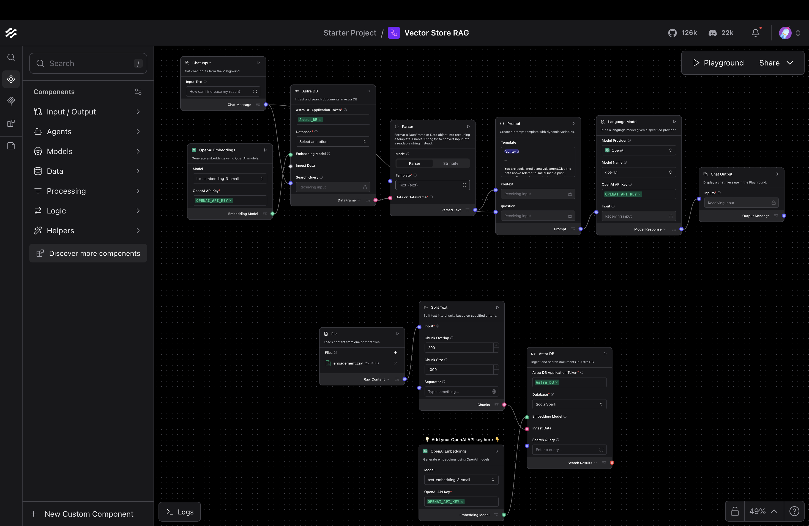

# ✨ SocialSpark

**SocialSpark** is a query-driven platform designed to ignite your social media growth by providing AI-powered insights for instagram. The platform fetches detailed social media data, including engagement metrics, audience insights, and performance analytics, using advanced APIs. This data is securely stored in **DataStax Astra DB**, ensuring scalable and efficient data management.

Leveraging **Langflow** for advanced query processing, SocialSpark allows users to ask specific, natural-language questions such as:

- ❓ _"What is the average engagement rate on my posts last month?"_
- ❓ _"Which type of content (images, videos, or carousels) performs best?"_
- ❓ _"When is the optimal time to post for maximum reach?"_
- ❓ _"What hashtags should I use for my niche?"_

The platform processes these queries using powerful AI models to deliver actionable insights instantly, empowering **content creators**, **influencers**, **marketers**, and **businesses** to optimize their social media strategies effectively across all platforms.

## 🧑‍💻 Technologies Used

- 🤖 **Chat gpt Embedding Models:** For data embedding and analysis.
- 📦 **DataStax Astra DB:** For efficient vector storage and data retrieval.
- 🧠 **Gemini & Langflow:** To build modular and scalable query pipelines.
- 🐍 **Flask:** For backend API management and data flow handling.
- ⚡ **Next.js:** For dynamic and responsive frontend development.
- 🎨 **Tailwind CSS:** Styled for a modern, mobile-friendly experience.

---

## System Design of LangFlow



## 🌟 Features

- 📈 **Advanced Analytics:** Compare post performances across different content types and platforms.
- 🤖 **AI-Powered Chat Assistant:** Get instant, personalized recommendations through natural language queries.
- 🎯 **Audience Insights:** Understand your audience demographics and behavior patterns.
- ⏰ **Optimal Timing:** Discover the best times to post for maximum engagement.
- 🏷️ **Hashtag Optimization:** Get AI-suggested hashtags tailored to your content and niche.
- 📦 **Scalable Storage:** Uses **DataStax Astra DB** for low-latency storage and retrieval.

---

## 🛠️ Installation

### ⚡ Prerequisites

- ✅ Node.js, Flask installed.
- ✅ Access to **DataStax Astra DB**.
- ✅ Social media platform API access (optional for enhanced features).

### 🖥️ Backend Setup (Flask)

```bash
git clone https://github.com/Vaibhavsahu2810/socialspark.git
cd socialspark
python -m venv venv
source venv/bin/activate  # For Windows use: venv\\Scripts\\activate
pip install -r requirements.txt
python server.py
```

### 🌐 Frontend Setup (Next.js)

```bash
cd src
npm install --legacy-peer-deps
npm run dev
```

### 📦 Environment Variables

Create a `.env` file in the **root directory** with the following keys:

```plaintext
ASTRA_DB_API_ENDPOINT=<your-astra-db-api-endpoint>
ASTRA_DB_APPLICATION_TOKEN=<your-astra-db-application-token>
KEYSPACE=<your-keyspace-name>
ASTRA_DB_COLLECTION_NAME=<your-collection-name>
LANGFLOW_ID=<your-langflow-id>
ENDPOINT=<your-langflow-endpoint>

```

---

## ✅ How to Use

1. **Connect Your Social Media:** Link your social media accounts to fetch engagement data across platforms.
2. **Ask Smart Questions:** Query your data with natural language like _"What content type gets the most engagement?"_
3. **Get AI Insights:** SocialSpark provides instant, data-driven recommendations to spark your social media growth.
4. **Optimize Strategy:** Use the insights to refine your content strategy and posting schedule.
5. **Track Progress:** Monitor your growth and engagement improvements over time.

---

## 🚀 Key Benefits

- **🎯 Data-Driven Decisions:** Make informed content choices based on real analytics
- **⚡ Instant Insights:** Get immediate answers to your social media questions
- **📱 Multi-Platform Support:** Manage all your social media from one dashboard
- **🤖 AI-Powered Recommendations:** Leverage cutting-edge AI for content optimization
- **📈 Growth Tracking:** Monitor your progress and celebrate your wins

---

## 🤝 Contributing

We welcome contributions! Please feel free to submit a Pull Request. For major changes, please open an issue first to discuss what you would like to change.

---

## 📄 License

This project is licensed under the MIT License - see the [LICENSE](LICENSE) file for details.

---

## 🙏 Acknowledgments

- Thanks to the DataStax team for providing excellent vector database solutions
- Hugging Face for their powerful embedding models
- The open-source community for their invaluable contributions

---
